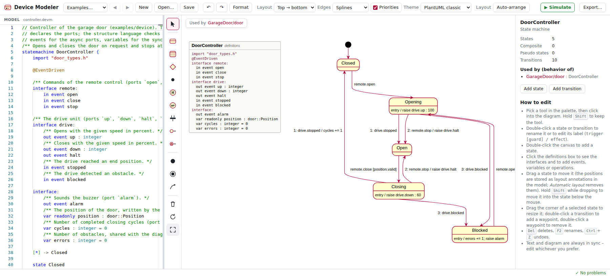

# Device Modeler

A [Langium](https://langium.org) based modeling environment for devices: the **structure of a product**
(components with their ports, subsystems, threads, instances and connections – structure files) and
the **hierarchical state machines** that implement the behavior of its components. Both are model files
with the extension **`.devm`** – a file contains either a state machine or structure elements (structs,
components, subsystems, systems), never both – and unit tests of state machines are `.devmtest`
files. Both are edited as text and in graphical editors built on
[Sprotty](https://sprotty.org) and [ELK](https://eclipse.dev/elk/): the state machine diagrams look like
PlantUML state diagrams, structures are shown as SysML internal block diagrams in the same themes – and you
can edit them directly: add states, draw transitions, nest states by drag and drop, add instances and
connect ports, rename in place, … Text and diagram always stay in sync, and the structure links to the
state machines: double-click an instance to open its state machine.

**Try it online:** [armaxri.github.io/DeviceModeler/main/](https://armaxri.github.io/DeviceModeler/main/) – the
web editor with the example models, running completely in the browser (every branch is published, see the
[overview](https://armaxri.github.io/DeviceModeler/)). The same editor runs in the desktop app, in VS Code,
Eclipse and the JetBrains IDEs, next to the command line tool `devm` with its language server `devm lsp`
(see [Installation and usage](docs/installation.md)).

The Device Modeler started as a fork of [HSM](https://github.com/armaxri/HSM) (the hierarchical state machine
modeler): the state machine language, its tools and the IDE integrations come from there; the structure
language and the internal block diagrams were added here, and every name was changed to *Device Modeler* /
`devm`.


## Structure of a product (structure files)

The structure elements of `.devm` files ([docs/structure-language.md](docs/structure-language.md), example
[`examples/device`](examples/device)).
The kind of a `.devm` file is decided by its first word: a file starting with `statemachine` is a state
machine, every other file is a structure file.


- **Component types** with **ports as directed data flow**: every port carries data in a direction –
  **sync** ports data values (`in sync position : door::Position`, `out sync cycles : integer`, shared
  data `inout sync errors : integer`; a simple type, a struct or a C/C++ type of an imported header),
  **async** ports exactly one event named like the port with an optional payload (`in async open`,
  `out async up : integer`). A component can be implemented by a state machine (`behavior "door.devm"`):
  its ports are checked against the interfaces of the state machine (`out sync` = `var`, `in sync` =
  `var readonly`, `inout sync` = `var`, `in` / `out async` = `in` / `out event`).
- **Subsystems** (`subsystem`, composite component types) and the root **`system`**: **threads**
  (`@priority(5) @period(10 ms)`) with the instances of components running in them, instances of other
  subsystems outside of the threads (recursive nesting; their parts run in threads of their own),
  explicit **connections** in the direction of the data (`connect door.up -> drive.up`, out → in; inout ↔
  inout) and **delegations** to the boundary ports of a subsystem (`delegate open -> door.open`, `delegate diag.report -> report`).
  The `system` is the **closed, complete top level**: it has no ports – its environment (the remote control,
  the status display) is modeled as parts (`system GarageInstallation` in `examples/device/system.devm`).
- **Validation**: unconnected in ports, more than one source of a sync in port (sender of an async in port), mismatching kinds, types,
  payloads and directions, connections crossing threads (shown dashed), ports that do not match the state
  machine, unresolved imports, …
- **Route analysis**: selecting a port, connector or instance highlights the whole data path across
  connections and delegations through all levels of the hierarchy and all files; the *sources* of an in
  port, the *targets* of an out port, *go to source*.
- **Internal block diagram** (SysML style, PlantUML themes): frames for the subsystem / system and its
  threads, instances with stereotypes, ports as **hollow (sync data) / filled (async event) squares with an
  arrow for the direction** (in / out / inout) and their type, connectors with an arrowhead at the receiving
  end; the structs declared in the file as separate «struct» boxes.
  **Graphical editing** like the state machine diagrams (palette for threads, instances, the five kinds of
  ports and connectors with compatibility feedback – written out → in whichever way they are drawn –, rename,
  drag into threads, properties panel) – every action is a text edit; **navigation** between systems,
  subsystems, component types, data types and state machines with a back / forward history.
- **Tools**: every host supports structure files – the web editor, the desktop app, the VS Code extension
  (language server, diagram, navigation, edits across files), the Eclipse and JetBrains plugins (structure
  diagram and navigation in the embedded editor, language server in the text editor), the language server
  `devm lsp` for other editors and the command line tool (`devm validate`, `devm render` as SVG). Not (yet)
  supported: simulation, code generation and `devm doc` of structure files.

## State machines (state machine files)



- **Textual DSL** (Langium): the structure of the state machine (states, regions, transitions) uses a
  PlantUML-like notation, the definition section and all reactions follow the statechart language of
  [itemis CREATE](https://www.itemis.com/en/products/itemis-create/) (formerly YAKINDU Statechart Tools):
  - **definition section**: interfaces (`in` / `out` events with optional payload types, variables,
    constants, operations), named interfaces, an `internal` scope, `namespace` and annotations such as
    `@EventDriven` or `@CycleBased(100)`
  - **reactions** `trigger, trigger [guard] / effect` with event triggers, **time events**
    (`after 10 s`, `every 200 ms`), `always`, `oncycle`, `entry`, `exit`, `else` / `default`
  - an **expression language** for guards and effects: assignments (`=`, `+=`, …), arithmetic, logical,
    bitwise and conditional operators, operation calls, `raise event : value`, `valueof(event)`,
    `active(State)`, casts with `as`
  - composite states, orthogonal regions, initial / final states, choice, junction, shallow and deep
    history, **synchronization** (`sync`, fork / join), named **entry points** and **exit nodes**
  - vertices are referenced by (partially) qualified names (`Playing`, `Active.Playing`,
    `Closed.Active.Playing`), so the same simple name can be used in different composite states
  - **imports** of other state machines (submachine instances) and of **C/C++ headers**: models use the
    enums, structs, type aliases and constants of the application's headers (`var mode : motor::Mode`,
    `pos.x = motor::kHome.x`), in the simulator, the unit tests and the generated C++ code (see
    [C/C++ header imports](docs/language.md#cc-header-imports))
  - **C++ class sections** `public:` / `protected:` / `private:`: data members and member functions of the
    generated C++ class with C++ types (`var errorCnt : unsigned int`, `operation setConfig(config : const
    app::Config&)`), used in guards and effects, implemented by the application, with their doc comments (see
    [C++ class sections](docs/language.md#c-class-sections))
- **Language services** in the browser: syntax highlighting, validation, code completion (events,
  variables, operations, qualified state names), formatting, go to definition, find references and
  rename (Monaco editor).
- **Validation**: duplicate names, unresolved references, missing or multiple initial transitions,
  transitions between orthogonal regions, non-deterministic transitions, unreachable states, misplaced
  history states, entry points / exit nodes / synchronizations used incorrectly, … Problems are shown in
  the editor *and* as markers in the diagram.
- **Diagram** (Sprotty + ELK layered layout) in the style of PlantUML: rounded states with name and
  compartment of local reactions (long lines are wrapped, the full text is shown as tooltip), nested
  states, dashed region separators, black initial dots, bull's-eye final states, choice diamonds,
  `H` / `H*` history circles, black synchronization bars, hollow entry point circles and crossed exit
  node circles with their names. The **definition section** is shown as a box at the top left, like in
  itemis CREATE. **Transition priorities** are shown like in itemis CREATE: if a vertex has several
  outgoing transitions, their labels are prefixed with the priority (`1: ev [g] / a`; toggle
  *Priorities* in the toolbar). Themes: *PlantUML classic* (yellow/red), *PlantUML modern* (gray) and
  *Dark*. Top-down or left-right layout, orthogonal, rounded, polyline, smooth or spline edges.
- **Graphical editing** – every diagram operation is translated into a minimal text edit, so comments
  and formatting are preserved and everything is undoable with `Ctrl+Z`:
  - palette tools for states, regions, choice, junction, history, synchronization, entry points, exit
    nodes, initial and final states and transitions
  - double-click to rename a state or to edit the label of a transition (`trigger [guard] / effect`,
    with completion of event and variable names); labels and actions are checked for syntax errors
    before they are applied
  - drag a state onto another state (or region) to nest it, onto the canvas to move it to the top level
  - properties panel for names, descriptions, entry / exit actions, reactions and to reconnect
    transitions; the panel of the definition section adds declarations (events, variables, constants,
    operations) to the right scope and creates `interface:` / `internal:` if necessary
  - `Del` deletes (including all attached transitions), `F2` renames
- **Simulation** in the editor, like the simulation view of itemis CREATE: raise events, run cycles,
  advance the virtual clock or let it run in real time (0.1× – 10×), inspect and change variables, mock
  operation results, watch out events, operation calls and the execution trace. Active states and the
  transitions just taken are highlighted in the diagram; breakpoints on states and transitions pause
  real-time mode (see [Simulation](docs/editor.md#simulation)).
- **Selection sync**: selecting an element in the diagram highlights its text, moving the cursor in the
  text selects the element in the diagram.
- **Export** of the diagram as standalone SVG or PNG (*Export…* in the toolbar; the PNG has twice the
  screen resolution).
- **CLI** (`devm`) for validation, layout computation, rendering, code generation, tests and the language
  server (`devm lsp`), also as a self-contained executable without Node.js.
- **Rendering and documentation without a browser**: `devm render` writes the diagrams as SVG files that look
  like the editor's export, `devm doc` generates Markdown or HTML documentation of models (diagram,
  interfaces, states, transitions and `/** … */` doc comments) – see [Rendering diagrams](docs/rendering.md#rendering-diagrams)
  and [Model documentation](docs/rendering.md#model-documentation), examples in [`docs/examples`](docs/examples/index.md).
- **Unit tests** for state machines in the style of SCTUnit (`.devmtest` files, see [Unit tests](docs/testing.md#unit-tests)),
  executed by the interpreter, with JUnit XML reports for CI.
- **Code generation** for **C++** (a class per state machine like itemis CREATE, see
  [Code generation (C++)](docs/cpp-generator.md)) and C99, both verified against the conformance suite of the
  interpreter by compiling and running every scenario.
- **VS Code extension** (`packages/vscode`): language server for `.devm` and `.devmtest` files, the diagram
  editors of the web app (state machines and structures) next to the text editor, C++ generation, tests in
  the Test Explorer (with model coverage), **debugging of tests** (breakpoints in tests and models, stepping
  through the microsteps, the live diagram) and the itemis CREATE import – see [VS Code extension](docs/vscode.md).
- **Desktop app** *Device Modeler* (`packages/desktop`, Electron): the web editor in a native window on the
  files on disk, for state machines and structure files – see [Installation and usage](docs/installation.md#desktop-app).
- **Eclipse plugin** (prototype, `eclipse-plugin/`): the web app as editor of `.devm` files in the Eclipse
  IDE (embedded browser), for state machines and structure files: workspace files with dirty state, Save As and
  rename, problems in the Problems view, Outline, Eclipse's edit commands, imports and navigation within the
  project, C++ generation, and the language server in Eclipse's Generic Editor (LSP4E / TM4E) – see
  [eclipse-plugin/README.md](eclipse-plugin/README.md).
- **JetBrains plugin** (prototype, `jetbrains-plugin/`): the web app as editor of `.devm` files in CLion,
  IntelliJ IDEA and the other JetBrains IDEs (JCEF), for state machines and structure files: views *Text* /
  *Text and Diagram* / *Diagram* on the IDE's document, problems in the editor and the Problems tool window
  (closed files with `devm validate`), Structure view, edit shortcuts in the page, C++ generation, and the
  language server in the text editor with LSP4IJ – see [jetbrains-plugin/README.md](jetbrains-plugin/README.md).
- **Other editors**: `devm lsp --stdio` is the language server for any LSP client (Neovim, Helix, Emacs, …,
  see [Language server](docs/installation.md#language-server-devm-lsp)).
- **Build integration**: a generator configuration file (`devm.gen.json`, like the `.sgen` files of itemis
  CREATE), `devm generate --check` for CI and CMake functions (`devm_generate`, `devm_add_tests`) that
  regenerate the code when a model changes (see [Build integration (CMake)](docs/build-integration.md)).

## Getting started

### Installation

Download from the [releases](https://github.com/armaxri/DeviceModeler/releases) (or the artifacts of the
*Distribution* workflow) – no Node.js needed:

- **Desktop app *Device Modeler*** (Windows installer / zip, macOS `.dmg`, Linux AppImage / `.deb`): the
  graphical editor in a native window, opening and saving `.devm` files on disk.
- **Command line tool `devm`** (one executable per platform): all commands below, e.g. for builds and CI,
  and the language server `devm lsp`.
- **VS Code extension** (`.vsix`), **Eclipse plugin** (update site archive) and **JetBrains plugin** (`.zip`).

```bash
devm validate examples/cd-player.devm
devm generate cpp examples/traffic-light.devm -o gen
```

Or use the [online sample](https://armaxri.github.io/DeviceModeler/main/) without installing anything.
Nothing is signed with a certificate: see [Installation and usage](docs/installation.md) for the macOS and
Windows warnings, the features of the desktop app and how everything is built.

### Development

Requires Node.js ≥ 20.10.

```bash
npm install
npm run dev        # starts the editor on http://localhost:5173
```

Other scripts:

```bash
npm test           # unit tests of the language package, the VS Code extension and the desktop app
npm run build      # langium generate + TypeScript build + web app (packages/web/dist) + extension bundles (packages/vscode/dist)
npm run typecheck
npm run package:vscode   # packages/vscode/devm-vscode-<version>.vsix
npm run build:exe        # packages/cli/dist/bin/<platform>/devm: the CLI without Node.js
npm run package:desktop  # packages/desktop/release/: the desktop app (installers of this platform)
npm start -w packages/desktop   # the desktop app from the sources
```

To try the IDE integrations, `npm run ide:vscode`, `npm run ide:eclipse`, `npm run ide:clion` and
`npm run ide:desktop` build the plugin and start the IDE with it and the examples – in a sandbox (`.ide/`), without
touching your IDE installations and settings (see [Trying the plugins locally](docs/installation.md#trying-the-plugins-locally)).

### Command line

The command line tool is `devm` (`npm install -g ./packages/language` after the build, or
`node packages/language/bin/cli.js` as below):

```bash
npm run build -w packages/language
node packages/language/bin/cli.js validate examples/cd-player.devm
node packages/language/bin/cli.js validate --json examples/*.devm     # problems as JSON (IDE integrations)
node packages/language/bin/cli.js layout examples/keyboard.devm --direction RIGHT
node packages/language/bin/cli.js render examples -o out --theme modern     # SVG diagrams, see below
node packages/language/bin/cli.js render examples/device/system.devm -o system.svg   # internal block diagram of the closed system
node packages/language/bin/cli.js doc examples -o docs/models --format html  # documentation, see below
node packages/language/bin/cli.js import model.sct -o model.devm   # itemis CREATE import, see below
node packages/language/bin/cli.js simulate examples/cd-player.devm -e play,eject,eject   # run the interpreter
node packages/language/bin/cli.js simulate examples/door.devm --script packages/language/test/scenarios/example-door.json
node packages/language/bin/cli.js test examples/tests/*.devmtest --machine examples --junit report.xml   # unit tests
node packages/language/bin/cli.js generate cpp examples/traffic-light.devm -o gen   # C++ code, see below
node packages/language/bin/cli.js generate c examples/traffic-light.devm -o gen     # C code
node packages/language/bin/cli.js generate                  # all models / targets of ./devm.gen.json, see below
node packages/language/bin/cli.js generate --check          # exit 1 if generated files are out of date (CI)
node packages/language/bin/cli.js lsp --stdio               # language server for LSP clients (docs/installation.md)
```

## Documentation

| Document | Content |
| --- | --- |
| [The language](docs/language.md) | syntax of the models: definition section, reactions, expressions, states, regions, pseudo states; imports and submachines; C/C++ header imports; C++ class sections |
| [Structure language](docs/structure-language.md) | structure files: components, ports, subsystems, threads, instances, connections; port ↔ state machine rules; route analysis |
| [Execution semantics](docs/semantics.md) | how a state machine executes – the specification implemented by the interpreter and the code generators |
| [Web editor](docs/editor.md) | editing in the diagram, structure diagrams and navigation, manual layout, simulation |
| [Manual layout](docs/manual-layout.md) | layout annotations in the model (state machines and structure diagrams), layout computation, routing, editor integration, migration |
| [Installation and usage](docs/installation.md) | online sample, downloads, desktop app, command line executable `devm` and language server `devm lsp`, VS Code, Eclipse, JetBrains IDEs; unsigned downloads; how they are built; trying the plugins locally (`npm run ide:*`) |
| [VS Code extension](docs/vscode.md) | language server, diagrams, structure files, generation, Test Explorer, debugging tests (details in [packages/vscode/README.md](packages/vscode/README.md)) |
| [Rendering and model documentation](docs/rendering.md) | `devm render` (SVG diagrams), `devm doc` (Markdown / HTML documentation), doc comments |
| [Unit tests and coverage](docs/testing.md) | the `.devmtest` language, `devm test`, model coverage, CI examples |
| [Code generation (C++)](docs/cpp-generator.md) | generated API, runtime errors, a complete host example |
| [Code generation (C)](docs/c-generator.md) | C99 generator |
| [Build integration (CMake)](docs/build-integration.md) | `devm.gen.json`, installing the command line tool, `devm_generate` / `devm_add_tests` |
| [Importing itemis CREATE models](docs/itemis-import.md) | `.sct` import and its mapping |
| [C++ integration](docs/cpp-integration.md) | the C++ header analyzer, the supported C++ subset and design decisions |
| [Architecture](docs/architecture.md) | packages, source files and the editing pipeline |
| [Examples](docs/examples/index.md) | generated documentation of the example models |
| [Possible improvements](docs/improvements.md) · [Roadmap](ROADMAP.md) | what could come next, what has been done |

## Architecture

The repository is an npm workspace with five packages: `packages/language` (the Langium languages – the
`.devm` language of state machines and structures and the unit test language –, CLI, interpreter, test
runner, renderer and code generators – no DOM dependencies, runs in Node.js and in the browser),
`packages/web` (the Vite web app: Monaco editor and Sprotty diagram), `packages/vscode` (the VS Code
extension), `packages/desktop` (the Electron desktop app around the web app) and `packages/cli` (the
self-contained `devm` command line executable); `eclipse-plugin/` is the Eclipse plugin (Maven / Tycho),
`jetbrains-plugin/` the JetBrains plugin (Gradle). The npm packages are named `devm-language`, `devm-web`,
`devm-vscode`, `devm-cli` and `devm-desktop`. The text is the single source of truth: diagram edits become text edits, which run
through the same parse → validate → layout → render pipeline as typed changes. See
[docs/architecture.md](docs/architecture.md) for the details.
