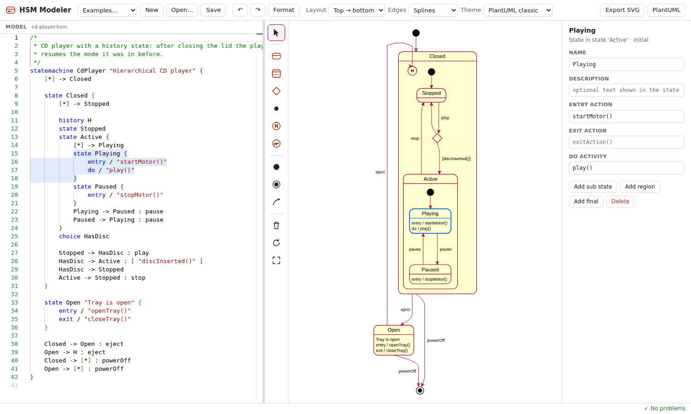

# HSM Modeler

A [Langium](https://langium.org) based modeling environment for **hierarchical state machines** with a
graphical editor built on [Sprotty](https://sprotty.org) and [ELK](https://eclipse.dev/elk/).
The diagrams look like PlantUML state diagrams, but you can edit them directly: add states, draw
transitions, nest states by drag and drop, rename in place, … Text and diagram always stay in sync.



## Features

- **Textual DSL** (Langium): the structure of the state machine (states, regions, transitions) uses a
  PlantUML-like notation, the definition section and all reactions follow the statechart language of
  [itemis CREATE](https://www.itemis.com/en/products/itemis-create/) (formerly YAKINDU Statechart Tools):
  - **definition section**: interfaces (`in` / `out` events with optional payload types, variables,
    constants, operations), named interfaces, an `internal` scope, `namespace` and annotations such as
    `@EventDriven` or `@CycleBased(100)`
  - **reactions** `trigger, trigger [guard] / effect` with event triggers, **time events**
    (`after 10 s`, `every 200 ms`), `always`, `oncycle`, `entry`, `exit`, `else` / `default`
  - an **expression language** for guards and effects: assignments (`=`, `+=`, …), arithmetic, logical,
    bitwise and conditional operators, operation calls, `raise event : value`, `valueof(event)`,
    `active(State)`, casts with `as`
  - composite states, orthogonal regions, initial / final states, choice, junction, shallow and deep
    history, **synchronization** (`sync`, fork / join), named **entry points** and **exit nodes**
  - vertices are referenced by (partially) qualified names (`Playing`, `Active.Playing`,
    `Closed.Active.Playing`), so the same simple name can be used in different composite states
  - **imports** of other state machines (submachine instances) and of **C/C++ headers**: models use the
    enums, structs, type aliases and constants of the application's headers (`var mode : motor::Mode`,
    `pos.x = motor::kHome.x`), in the simulator, the unit tests and the generated C++ code (see
    [C/C++ header imports](docs/language.md#cc-header-imports))
- **Language services** in the browser: syntax highlighting, validation, code completion (events,
  variables, operations, qualified state names), formatting, go to definition, find references and
  rename (Monaco editor).
- **Validation**: duplicate names, unresolved references, missing or multiple initial transitions,
  transitions between orthogonal regions, non-deterministic transitions, unreachable states, misplaced
  history states, entry points / exit nodes / synchronizations used incorrectly, … Problems are shown in
  the editor *and* as markers in the diagram.
- **Diagram** (Sprotty + ELK layered layout) in the style of PlantUML: rounded states with name and
  compartment of local reactions (long lines are wrapped, the full text is shown as tooltip), nested
  states, dashed region separators, black initial dots, bull's-eye final states, choice diamonds,
  `H` / `H*` history circles, black synchronization bars, hollow entry point circles and crossed exit
  node circles with their names. The **definition section** is shown as a box at the top left, like in
  itemis CREATE. **Transition priorities** are shown like in itemis CREATE: if a vertex has several
  outgoing transitions, their labels are prefixed with the priority (`1: ev [g] / a`; toggle
  *Priorities* in the toolbar). Themes: *PlantUML classic* (yellow/red), *PlantUML modern* (gray) and
  *Dark*. Top-down or left-right layout, spline / orthogonal / polyline edges.
- **Graphical editing** – every diagram operation is translated into a minimal text edit, so comments
  and formatting are preserved and everything is undoable with `Ctrl+Z`:
  - palette tools for states, regions, choice, junction, history, synchronization, entry points, exit
    nodes, initial and final states and transitions
  - double-click to rename a state or to edit the label of a transition (`trigger [guard] / effect`,
    with completion of event and variable names); labels and actions are checked for syntax errors
    before they are applied
  - drag a state onto another state (or region) to nest it, onto the canvas to move it to the top level
  - properties panel for names, descriptions, entry / exit actions, reactions and to reconnect
    transitions; the panel of the definition section adds declarations (events, variables, constants,
    operations) to the right scope and creates `interface:` / `internal:` if necessary
  - `Del` deletes (including all attached transitions), `F2` renames
- **Simulation** in the editor, like the simulation view of itemis CREATE: raise events, run cycles,
  advance the virtual clock or let it run in real time (0.1× – 10×), inspect and change variables, mock
  operation results, watch out events, operation calls and the execution trace. Active states and the
  transitions just taken are highlighted in the diagram; breakpoints on states and transitions pause
  real-time mode (see [Simulation](docs/editor.md#simulation)).
- **Selection sync**: selecting an element in the diagram highlights its text, moving the cursor in the
  text selects the element in the diagram.
- **Export** of the diagram as standalone SVG or PNG (*Export…* in the toolbar; the PNG has twice the
  screen resolution).
- **CLI** for validation, layout computation, rendering and code generation.
- **Rendering and documentation without a browser**: `hsm render` writes the diagrams as SVG files that look
  like the editor's export, `hsm doc` generates Markdown or HTML documentation of models (diagram,
  interfaces, states, transitions and `/** … */` doc comments) – see [Rendering diagrams](docs/rendering.md#rendering-diagrams)
  and [Model documentation](docs/rendering.md#model-documentation), examples in [`docs/examples`](docs/examples/index.md).
- **Unit tests** for state machines in the style of SCTUnit (`.hsmtest` files, see [Unit tests](docs/testing.md#unit-tests)),
  executed by the interpreter, with JUnit XML reports for CI.
- **Code generation** for **C++** (a class per state machine like itemis CREATE, see
  [Code generation (C++)](docs/cpp-generator.md)) and C99, both verified against the conformance suite of the
  interpreter by compiling and running every scenario.
- **VS Code extension** (`packages/vscode`): language server for `.hsm` / `.hsmtest`, the diagram editor
  of the web app next to the text editor, C++ generation, tests in the Test Explorer (with model
  coverage) and the itemis CREATE import – see [VS Code extension](docs/vscode.md).
- 🧪 **Eclipse plugin** (prototype, `eclipse-plugin/`): the web app as editor of `.hsm` files in the Eclipse
  IDE (embedded browser, the workspace file is loaded and saved, dirty state) – see
  [eclipse-plugin/README.md](eclipse-plugin/README.md).
- **Build integration**: a generator configuration file (`hsm.gen.json`, like the `.sgen` files of itemis
  CREATE), `hsm generate --check` for CI and CMake functions (`hsm_generate`, `hsm_add_tests`) that
  regenerate the code when a model changes (see [Build integration (CMake)](docs/build-integration.md)).

## Getting started

Requires Node.js ≥ 20.10.

```bash
npm install
npm run dev        # starts the editor on http://localhost:5173
```

Other scripts:

```bash
npm test           # unit tests of the language package and of the VS Code extension
npm run build      # langium generate + TypeScript build + web app (packages/web/dist) + extension bundles (packages/vscode/dist)
npm run typecheck
npm run package:vscode   # packages/vscode/hsm-vscode-<version>.vsix
```

### Command line

```bash
npm run build -w packages/language
node packages/language/bin/cli.js validate examples/cd-player.hsm
node packages/language/bin/cli.js layout examples/keyboard.hsm --direction RIGHT
node packages/language/bin/cli.js render examples -o out --theme modern     # SVG diagrams, see below
node packages/language/bin/cli.js doc examples -o docs/models --format html  # documentation, see below
node packages/language/bin/cli.js import model.sct -o model.hsm   # itemis CREATE import, see below
node packages/language/bin/cli.js simulate examples/cd-player.hsm -e play,eject,eject   # run the interpreter
node packages/language/bin/cli.js simulate examples/door.hsm --script packages/language/test/scenarios/example-door.json
node packages/language/bin/cli.js test examples/tests/*.hsmtest --machine examples --junit report.xml   # unit tests
node packages/language/bin/cli.js generate cpp examples/traffic-light.hsm -o gen   # C++ code, see below
node packages/language/bin/cli.js generate c examples/traffic-light.hsm -o gen     # C code
node packages/language/bin/cli.js generate                  # all models / targets of ./hsm.gen.json, see below
node packages/language/bin/cli.js generate --check          # exit 1 if generated files are out of date (CI)
```

## Documentation

| Document | Content |
| --- | --- |
| [The language](docs/language.md) | syntax of the models: definition section, reactions, expressions, states, regions, pseudo states; imports and submachines; C/C++ header imports |
| [Execution semantics](docs/semantics.md) | how a state machine executes – the specification implemented by the interpreter and the code generators |
| [Web editor](docs/editor.md) | editing in the diagram, 🧪 manual layout, simulation |
| [Manual layout](docs/manual-layout.md) | 🧪 experimental (branch `claude/layout-annotations`): layout annotations in the model, layout computation, routing, editor integration, migration |
| [VS Code extension](docs/vscode.md) | language server, diagram, generation, Test Explorer (details in [packages/vscode/README.md](packages/vscode/README.md)) |
| [Rendering and model documentation](docs/rendering.md) | `hsm render` (SVG diagrams), `hsm doc` (Markdown / HTML documentation), doc comments |
| [Unit tests and coverage](docs/testing.md) | the `.hsmtest` language, `hsm test`, model coverage, CI examples |
| [Code generation (C++)](docs/cpp-generator.md) | generated API, runtime errors, a complete host example |
| [Code generation (C)](docs/c-generator.md) | C99 generator |
| [Build integration (CMake)](docs/build-integration.md) | `hsm.gen.json`, installing the command line tool, `hsm_generate` / `hsm_add_tests` |
| [Importing itemis CREATE models](docs/itemis-import.md) | `.sct` import and its mapping |
| [C++ integration](docs/cpp-integration.md) | the C++ header analyzer, the supported C++ subset and design decisions |
| [Architecture](docs/architecture.md) | packages, source files and the editing pipeline |
| [Examples](docs/examples/index.md) | generated documentation of the example models |
| [Possible improvements](docs/improvements.md) · [Roadmap](ROADMAP.md) | what could come next, what has been done |

## Architecture

The repository is an npm workspace with three packages: `packages/language` (the Langium language, CLI,
interpreter, test runner, renderer and code generators – no DOM dependencies, runs in Node.js and in the
browser), `packages/web` (the Vite web app: Monaco editor and Sprotty diagram) and `packages/vscode` (the
VS Code extension). The text is the single source of truth: diagram edits become text edits, which run
through the same parse → validate → layout → render pipeline as typed changes. See
[docs/architecture.md](docs/architecture.md) for the details.
